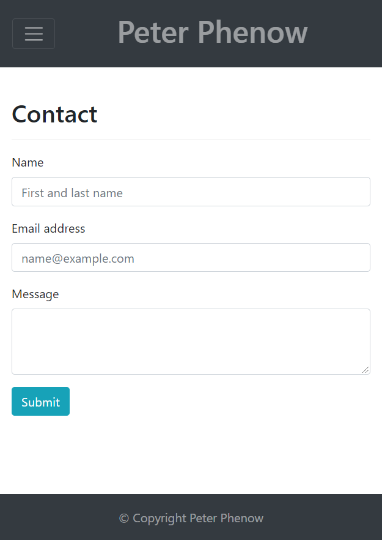

# HW2_Responsive_Portfolio

### **Objective:**

Create a responsive web application using Bootstrap to render well on all screen sizes. I was able to accomplish this without any media queries thanks to Bootstrap being very responsive on it's own. For now, this is just a basic layout, but as I grow and complete more projects, I will continue adding and updating content.

### **Link:**

[See deployed page here](https://phenom708.github.io/HW2_Responsive_Portfolio/)

### **Screenshots:**

#### Large Screen

&nbsp;&nbsp;

#### Small Screen

&nbsp;&nbsp;
